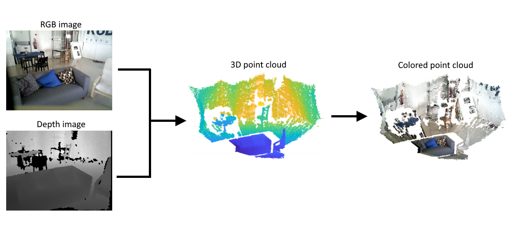
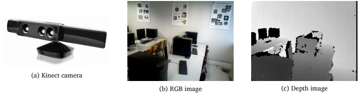
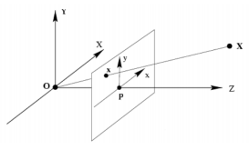
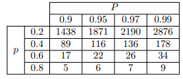
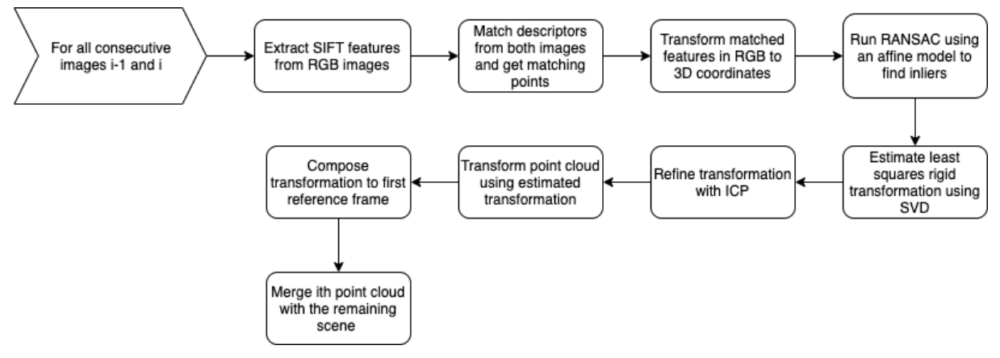
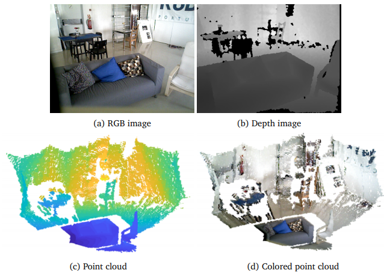

# 3D Point Cloud Registration

Reconstructs a 3D scene from a sequence of RGB and depth images captured with a Kinect camera. Each consecutive image pair is aligned using SIFT feature matching, RANSAC outlier rejection, and ICP refinement — then merged into a single unified point cloud.

Project developed for the Vision and Image Processing course at Instituto Superior Técnico (Fall 2019).

**Authors:** João Ribeiro · [Rafael Correia](https://sourcerer.io/leafarcoder) · Zuzanna Swiderska

---

## Getting Started

**Requirements**
- MATLAB (R2018b or later)
- [VLFeat](https://github.com/vlfeat/vlfeat) — add it to MATLAB path following [these instructions](https://github.com/vlfeat/vlfeat#quick-start-with-matlab)
- MATLAB Computer Vision Toolbox

**Running**

All the code lives in `code.m`. Open it in MATLAB and adjust the following before running:

- **Line 2** — which `.mat` dataset file to load (default: `sinteticotable.mat`)
- **Line 33** — path to scan for image datasets
- **Line 41** — which dataset from the discovered list to process

Then run the script. Available datasets are in the `datasets/` folder: `sinteticotable`, `vianaPiv`, `sala`, `board`, `parede`, `viewfroom`, `doitifyoucan`.

---

## How it works

- [1 Introduction](#1-introduction)
  - [1.1 Kinect camera](#11-kinect-camera)
  - [1.2 Pin-hole camera model](#12-pin-hole-camera-model)
  - [1.3 Feature detection with SIFT](#13-feature-detection-with-sift)
  - [1.4 Model fitting to noisy data with RANSAC](#14-model-fitting-to-noisy-data-with-ransac)
  - [1.5 Estimating transformation between two point clouds](#15-estimating-transformation-between-two-point-clouds)
  - [1.6 The ICP algorithm](#16-the-icp-algorithm)
- [2 Implementation](#2-implementation)

## 1 Introduction

The main purpose of this project is to reconstruct a 3D scene from a set of RGB and depth images (in 2D) acquired from a Kinect camera.

The problem is divided into sub-problems, each tackled by an individual component to increase modularity and testability. An overall view of the proposed solution is shown in the flowchart in Figure 3. The following sections present the acquisition tool (Section 1.1) and the theory (Sections 1.2 to 1.6) behind the solutions used (further discussed in Section 2).

### 1.1 Kinect camera
RGB and depth images were acquired using a Kinect camera (Intel RealSense). It uses a regular RGB camera alongside an infrared projector and camera that measures the distance from the device to the 3D world points visible in the RGB image.

Some drawbacks stem from the use of infrared (IR) light for depth sensing. It prevents outdoor use since sunlight's IR component overwhelms the projected IR pattern. Objects that don't reflect IR light well — mainly black-coloured surfaces — produce erroneous zero-depth readings, as can be seen in Figure 1c where the monitor and computer towers have no valid depth.

All images (RGB and depth) have a resolution of 640×480 pixels.

*Figure 1: Acquisition tool and RGB/depth pair examples*

### 1.2 Pin-hole camera model
The pin-hole camera model describes a camera as a transformation that projects 3D world points onto 2D points on an image plane.

Let $\mathbf{X}=[X,Y,Z]^T$ be the coordinates of a 3D world point and $\mathbf{x}=[x,y]^T$ its projection onto the image plane.

*Figure 2: Pin-hole camera model*

The projection is obtained by tracing a ray from the 3D point through the optical center O to the image plane. With focal distance $f$, the projected coordinates are:

$$y=f\frac{X}{Z} \quad,\quad x=f\frac{Y}{Z} \tag{1}$$

With unitary focal distance ($f=1$) and homogeneous coordinates:

$$\lambda \begin{bmatrix} x \\ y \\ 1 \end{bmatrix} = \begin{bmatrix} 1 & 0 & 0 & 0 \\ 0 & 1 & 0 & 0 \\ 0 & 0 & 1 & 0 \end{bmatrix} \begin{bmatrix} X \\ Y \\ Z \\ 1 \end{bmatrix} \tag{2}$$

The optical axis doesn't always intersect the image plane at the origin — there's an offset describable by a rotation $R$ and translation $T$. A unit conversion from meters to pixels is also needed. These together form the intrinsic parameter matrix $K$:

$$\lambda \begin{bmatrix} u \\ v \\ 1 \end{bmatrix} = K \begin{bmatrix} 1 & 0 & 0 & 0 \\ 0 & 1 & 0 & 0 \\ 0 & 0 & 1 & 0 \end{bmatrix} \begin{bmatrix} \mathbf{R} & \mathbf{T} \\ \mathbf{0}^T & 1 \end{bmatrix} \begin{bmatrix} X \\ Y \\ Z \\ 1 \end{bmatrix} \tag{3}$$

Since we're now in image coordinates in pixels, these are denoted $u$ and $v$ to distinguish them from the metric $x$ and $y$.

### 1.3 Feature detection with SIFT
The Scale-Invariant Feature Transform (SIFT) is an algorithm for detecting and matching features across images.

SIFT builds the scale space of an image by filtering it with Gaussian filters of increasing standard deviations (an octave). After each octave, the image is downsampled and the process repeats at a smaller scale.

Keypoints are found at extrema of the Laplacian of the image — regions that change locally in many directions. In practice, this is approximated by taking extrema of differences between consecutive Gaussian-filtered images. For each keypoint, local gradients are computed and summarised into a descriptor histogram oriented relative to the dominant gradient direction. This orientation-relative descriptor makes SIFT robust to rotation; its position-independence makes it invariant to translation; normalisation of the histogram handles global illumination changes; and computing descriptors across the scale space makes them scale invariant.

Features are matched by comparing descriptors, providing point correspondences that survive many image transformations.

### 1.4 Model fitting to noisy data with RANSAC
Random Sample Consensus (RANSAC) iteratively searches for the best estimate of a model's parameters from data that contains both inliers (explained by the model, possibly with noise) and outliers (data points deviating too far to be explained by any noise distribution).

The algorithm requires: a model, a dataset of $N$ points, the minimum number of points to instantiate the model ($n$), the probability of any point being an inlier ($p$), and a distance threshold $d$.

Steps:
1. Randomly sample $n$ points and fit the model to get parameters $\widehat{\Theta}$.
2. Compute the error $\varepsilon_i = |Y_i - \widehat{\Theta} X_i|$ for all points.
3. Classify each point as inlier or outlier:

$$Class(i) = \begin{cases} Inlier, & \text{if } \varepsilon_i \leq d \\ Outlier, & \text{if } \varepsilon_i > d \end{cases}$$

4. Count inliers. If this is the best so far, save these as the current best inliers.
5. Repeat for $k$ iterations.

The number of iterations needed to achieve probability $P$ of finding at least one all-inlier sample is:

$$k=\frac{\log(1-P)}{\log(1-p^n)}$$

*Table 1: Number of RANSAC iterations as a function of p and P*

### 1.5 Estimating transformation between two point clouds
The transformation between two rigid point clouds $p$ and $q$ is a 3D rigid body transformation: a rotation $R$ and translation $T$. The objective is to minimise:

$$E(R,T)=\sum_{i=1}^{N} \left \| \mathbf{q_i}-(R\mathbf{p_i}+\mathbf{T}) \right \|^2$$

First, compute and subtract the centroids from each point cloud:

$$q_{0}=q-\sum_{i=1}^{N} \frac{\mathbf{q_i}}{N}\quad,\quad p_{0}=p-\sum_{i=1}^{N} \frac{\mathbf{p_i}}{N}$$

The rotation and translation that minimise the equation above are obtained via SVD:

$$M=p_{0}\,q_{0}^T=U\Sigma V^T \tag{4}$$

$$\widehat{R}=VU^T \tag{5}$$

$$\widehat{\mathbf{T}}=\sum_{i=1}^{N} \frac{\mathbf{p_i}}{N}-\widehat{R}\sum_{i=1}^{N} \frac{\mathbf{q_i}}{N}$$

A proof that these minimise Equation 4 can be found in Appendix A.

### 1.6 The ICP algorithm
The Iterative Closest Point (ICP) algorithm minimises Equation 4 without knowing in advance which points correspond between two clouds. It picks a sub-sample of one cloud, finds the nearest neighbour in the other, keeps only the fraction with the lowest distances (to avoid matching non-overlapping regions), and estimates $R$ and $T$ from those pairs using the procedure in Section 1.5. This repeats until a stopping criterion is met (minimum nearest-neighbour distance or maximum iterations). Given a sufficiently good initial estimate, it converges to the correct alignment.

## 2 Implementation

Having laid down the theoretical foundations, here is the sequence of steps taken to solve the problem. A visual summary is in Figure 3.

*Figure 3: Flowchart summarising the steps to solve the proposed problem*

The main loop iterates over all consecutive image pairs. Let $RGB_i$ be the i-th RGB image and $D_i$ its corresponding depth image.

**Point cloud generation.** Image coordinates $u$ and $v$ are simply pixel indices (with $(0,0)$ at the top-left corner) and $Z$ is the depth at those coordinates. Using Equation 3 with $R = I$ and $T=[0,0,0]^T$ (still in the depth camera frame), $X$ and $Y$ are recovered by inverting Equation 3:

$$\begin{bmatrix} X \\ Y \\ Z \end{bmatrix}_m^d = K^{-1} \begin{bmatrix} u \times Z \\ v \times Z \\ Z \end{bmatrix}_{px}^d \tag{6}$$

The points then need to be transformed from the depth camera frame to the RGB camera frame, using a known rotation and translation between them:

$$\begin{bmatrix} X \\ Y \\ Z \end{bmatrix}^{RGB} = R_{d \to RGB} \begin{bmatrix} X \\ Y \\ Z \end{bmatrix}^d + \mathbf{T}_{d \to RGB} \tag{7}$$

This is applied to all points in the image pair. Figure 4 shows an example.

*Figure 4: Point cloud generation from an RGB/depth pair*

**Feature matching.** SIFT features and descriptors are extracted from the grayscale RGB images and matched between consecutive pairs. Detection thresholds are reduced to find as many features as possible — since correctly aligning 3D points is difficult, having a large pool of candidates helps ensure enough true matches survive outlier rejection. The matched points are then transformed from image coordinates into 3D coordinates in the RGB camera frame.

**RANSAC.** The two sets of matching 3D points are passed to RANSAC using a general 3D affine model:

$$\begin{bmatrix} X \\ Y \\ Z \\ 1 \end{bmatrix}_i = \begin{bmatrix} a_{11} & a_{12} & a_{13} & a_{14} \\ a_{21} & a_{22} & a_{23} & a_{24} \\ a_{31} & a_{32} & a_{33} & a_{34} \end{bmatrix} \begin{bmatrix} X \\ Y \\ Z \\ 1 \end{bmatrix}_{i-1} \tag{8}$$

This can be rewritten in closed form. For each set of 3D point correspondences:

$$\begin{bmatrix} X & Y & Z & 1 & 0 & 0 & 0 & 0 & 0 & 0 & 0 & 0 \\ 0 & 0 & 0 & 0 & X & Y & Z & 1 & 0 & 0 & 0 & 0 \\ 0 & 0 & 0 & 0 & 0 & 0 & 0 & 0 & X & Y & Z & 1 \end{bmatrix}_{i-1} \begin{bmatrix} a_{11} \\ \vdots \\ a_{34} \end{bmatrix} = \begin{bmatrix} X \\ Y \\ Z \end{bmatrix}_i \tag{9}$$

Which gives a system of the form:

$$A\mathbf{h}=\mathbf{X} \tag{10}$$

With exactly $n=4$ points this is a determined system solved directly; with more points it's over-determined and solved via the Moore-Penrose pseudo-inverse:

$$\mathbf{h}=(A^{T}A)^{-1}A^T\mathbf{X} \tag{12}$$

When sampled points are coplanar, $A$ becomes ill-conditioned. Whenever the condition number exceeds a threshold, that iteration is skipped and resampled. The affine model is chosen over the rigid one because it has a closed-form solution and its inliers are a superset of the rigid model's inliers. Given the large number of SIFT features detected, the number of RANSAC iterations is set to $k=2876$ with a 1 cm inlier distance threshold.

**Rigid transformation estimation.** From the RANSAC inliers, $R$ and $T$ are estimated using the SVD method from Section 1.5. One edge case to handle: SVD can produce $\det(R) = -1$ (a reflection rather than a rotation). This is corrected as follows:

$$\widehat{R} = V \begin{bmatrix} 1 & 0 & 0 \\ 0 & 1 & 0 \\ 0 & 0 & |VU^T| \end{bmatrix} U^T \tag{13}$$

The middle matrix is the identity unless $VU^T$ is a reflection, in which case its last diagonal element is $-1$, correcting it to a proper rotation.

**ICP refinement.** With an initial $R$ and $T$ from RANSAC, ICP refines the estimate. The $(i-1)$-th cloud is fixed; the $i$-th cloud is the moving one, downsampled to reduce computation time and improve accuracy. During ICP, only the 20% of matched pairs with the lowest Euclidean distance are used to estimate the transformation — this prevents unmatched regions (present in one cloud but not the other) from corrupting the estimate.

**Merging.** The final $R$ and $T$ from ICP are composed with the accumulated transformation from all previous steps to express the $i$-th cloud in the reference frame of the first cloud. For three clouds this looks like:

$$\mathbf{X_3}=R_{13}\mathbf{X_{1}}+\mathbf{T_{13}}\quad,\quad R_{13}=R_{23}R_{12}\quad,\quad \mathbf{T_{13}}=R_{23}\mathbf{T_{12}}+\mathbf{T_{23}} \tag{14}$$

This composition extends to any number of clouds, progressively merging everything into the first cloud's coordinate frame.
